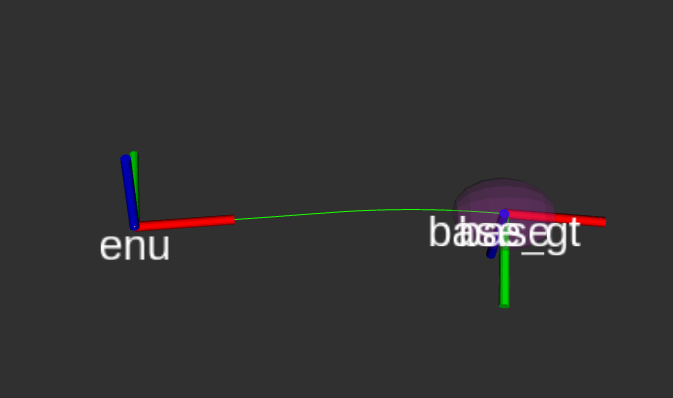

# IntNavLib

This is my playground c++ integrated navigation library.
The aim is to have a modular C++ API that can be used in integrated navigation applications. Integrated navigation applications using the IntNavLib API, including ROS2 nodes, are in the [apps](/apps/) folder.

The code is inspired by [Principles of GNSS, Inertial, and Multisensor Integrated Navigation](https://ieeexplore.ieee.org/document/9101092) by Paul Groves.

Reference: 

```
@BOOK{gpintnav,
  author={Groves, Paul},
  booktitle={Principles of GNSS, Inertial, and Multisensor Integrated Navigation Systems, Second Edition},
  year={2013}
  }
```


## Build & install instructions

1) Clone the library in your workspace

2) Install Eigen 3. On Ubuntu and other Debian-based Linux distributions, just: `sudo apt install libeigen3-dev`

3) Build & install the Cmake project:

```
cd intnavlib
mkdir build
cd build
cmake ..
sudo make install
```

If you need to uninstall the library, you can run this command in the build folder:

```
cd intnavlib/build
sudo xargs rm < install_manifest.txt
```

## Using IntNavLib

You can find apps using IntNavLib in the [apps](/apps/) folder.

For example, to build and run the inertial navigation demo using ECEF navigation equations, run: 

```
cd apps/ins_ecef
mkdir build && cd build
cmake ..
make -j4
./ins_ecef ../../data/Profile_3.csv
```

### ROS 2 App



This library also comes with an example of how to use it in a ROS2 project.
To launch a ROS2 node performing integrated loosely-coupled GNSS/INS navigation, first install ROS2 (Humble supported, other releases might require minor refactoring), then run for example:

```
cd apps/ros2_lc_ins_gnss_ecef
colcon build
source install/setup.bash
ros2 launch ros2_lc_ins_gnss_ecef Profile_3_launch.py log_level:=ERROR
```

Find Python scripts to plot results in Groves' style in the [utils](/utils/) directory. You can launch them like this:

```
python3 plot_profile.py <path_to_profile_csv> # to plot a motion profile
python3 plot_errors.py <path_to_errors_csv> # to plot nav errors
python3 plot_errors_sigmas_ecef.py <path_to_ecef_errors_sigmas_csv> # to plot errors + estimated uncertainty 

```

## TODOs

- ros2 app: do fast imu prop so state is not delayed.

- write test bash script to run all demos. launch it at each commit to check for bugs

- refactor to improve readability. review input arguments, comment headers google-style

- profile code with valgrind

- Remove dependencies: place eigen in include dir

## Future development

- Fuse Visual Odometry (simplified groves style)

- Add X2 Integrity check