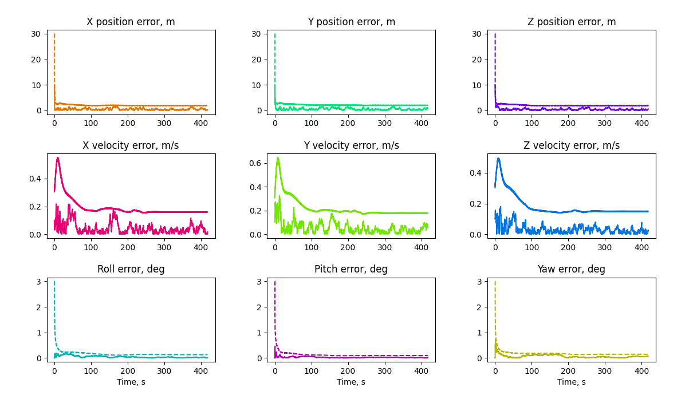

# IntNavLib

This is my playground c++ integrated navigation library.
The aim is to have a modular C++ API that can be used in integrated navigation applications. Integrated navigation applications using the IntNavLib API, including ROS2 nodes, are in the [apps](/apps/) folder.

The code is inspired by [Principles of GNSS, Inertial, and Multisensor Integrated Navigation](https://ieeexplore.ieee.org/document/9101092) by Paul Groves.

Reference: 

```
@BOOK{gpintnav,
  author={Groves, Paul},
  booktitle={Principles of GNSS, Inertial, and Multisensor Integrated Navigation Systems, Second Edition},
  year={2013}
  }
```

**Disclaimer**: If you are interested in embedded systems applications, you probably don't like dynamic memory allocation.
Avoiding dynamic memory allocation is tedious and painstakingly hard when using Eigen.
Have a look [here](https://github.com/stulp/eigenrealtime) if you're interested in making this code malloc-free.




## Build & install instructions

1) Clone the library in your workspace

2) Install Eigen 3. On Ubuntu and other Debian-based Linux distributions, just: `sudo apt install libeigen3-dev`

3) Build & install the Cmake project:

```
cd intnavlib
mkdir build
cd build
cmake ..
make install
```

## Using IntNavLib

You can find apps using IntNavLib in the [apps](/apps/) folder.

For example, to build and run the inertial navigation demo using ECEF navigation equations, run: 

```
cd apps/ins_ecef
mkdir build && cd build
cmake ..
make -j4
./ins_ecef ../../data/Profile_3.csv
```

### ROS 2 Apps

This library also comes with an example of how to use it in a ROS2 project.
To launch a ROS2 node performing integrated loosely-coupled GNSS/INS navigation, first install ROS2, then run:

```
cd apps/ros2_lc_ins_gnss_ecef
colcon build
source install/setup.bash
ros2 launch ros2_lc_ins_gnss_ecef Profile_3_launch.py
```

To debug the ROS2 node, in case you wish to edit something:

```
cd apps/ros2_lc_ins_gnss_ecef
colcon build --cmake-args -DCMAKE_BUILD_TYPE=Debug
source install/setup.bash;
ros2 run --prefix 'gdbserver localhost:3000' ros2_lc_ins_gnss_ecef ros2_lc_ins_gnss_ecef --ros-args --params-file config/Profile_3_config.yaml
# Now launch gdb server
```

To write a ROS2 bag with ground truth data and sensor measurements, instead:

```
cd apps/ros2_bag_writer
colcon build
source install/setup.bash
ros2 run ros2_bag_writer ros2_bag_writer ../../data/Profile_3.csv
```

To play the bag and start integrated navigation:

```
cd apps/ros2_bag_writer/output
ros2 bag play Profile.bag
```

To visualize in rviz:
```
rviz2 -d apps/ros2_lc_ins_gnss_ecef/config/config.rviz
```

Find Python scripts to plot results in Groves' style in the [utils](/utils/) directory. You can launch them like this:

```
python3 plot_profile.py <path_to_profile_csv> # to plot a motion profile
python3 plot_errors.py <path_to_errors_csv> # to plot nav errors
python3 plot_errors_sigmas_ecef.py <path_to_ecef_errors_sigmas_csv> # to plot errors + estimated uncertainty 

```

## TODOs

- profile generator in NED, converting from MATLAB's GeoTrajectory

- ros2 app: handle queue sizes (drop if full). log result to file for starters, to verify. use cond variables in waits. do data lag compensation (add delays in bag writer). in config, pass euler angles not DCM. publish path, belocity. fix bad exit stuck wait cv

- write test bash script to run all demos. launch it at each commit to check for bugs

- refactor to improve readability. review input arguments, comment headers google-style

- profile code with valgrind

- Remove dependencies: place eigen in include dir

## Future development

- write profile generator, navcam simulator

- Fuse map matching

- Fuse Lidar

- Fuse CVN

- Fuse Visual Odometry

- Add Integrity check